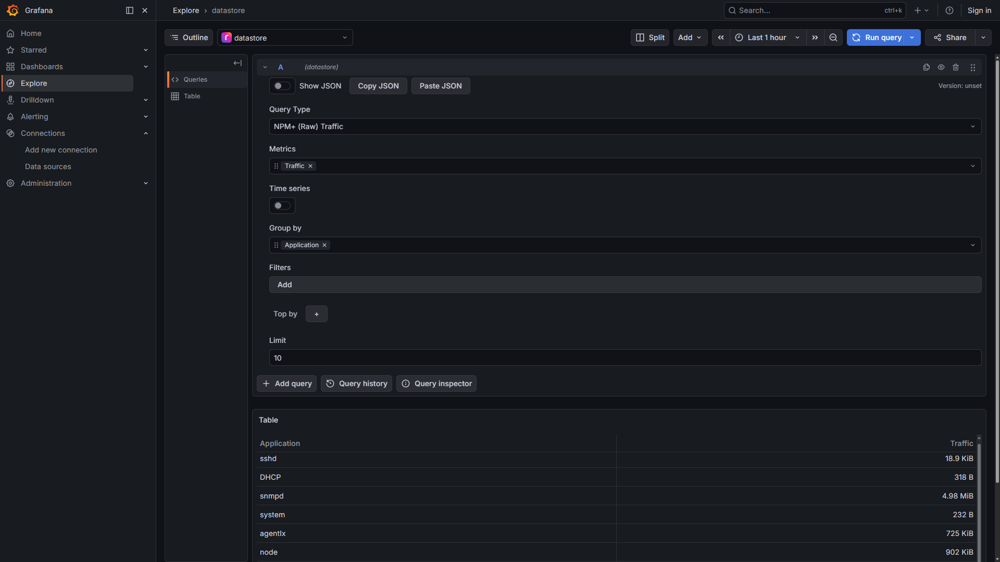
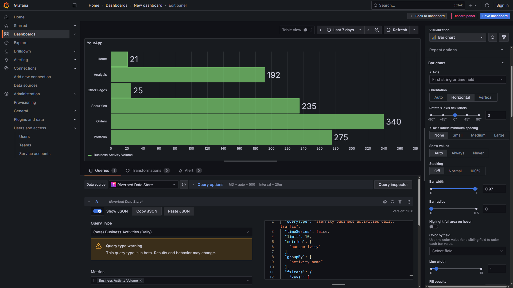

# Riverbed Data Store plugin for Grafana

**Riverbed Data Store plugin for Grafana** is an open‑source project developed by [Riverbed](https://www.riverbed.com) for Grafana users in the [Riverbed Community](https://community.riverbed.com).

## Work in Progress

> [!WARNING]
> This project is currently under active development.

Publishing the plugin to the official Grafana plugin catalog is in progress.

## Quick start

<details>
<summary>Grafana Setup</summary>

For a quick start, if you have Docker installed, it is easy to set up and run Grafana with the Riverbed plugin in a container.

1. Open a terminal and run:

   ```shell
   docker run -d -p 3000:3000 --name=grafana-with-riverbed-plugin \
     -e GF_PLUGINS_ALLOW_LOADING_UNSIGNED_PLUGINS=riverbed-datastore-datasource \
     -e GF_PLUGINS_PREINSTALL="riverbed-datastore-datasource@@https://github.com/riverbed/grafana-riverbed-datasource/releases/download/v1.0.20260325125536/riverbed-datastore-datasource-1.0.20260325125536.zip" \
     grafana/grafana:latest
   ```
2. Open your browser and go to [http://localhost:3000](http://localhost:3000)

3. Log in with the default username `admin` and password `admin`.


> **Tip** You can use a different version of the plugin by copying the desired link from the [Riverbed plugin release page](https://github.com/riverbed/grafana-riverbed-datasource/releases) and replacing the URL in the command above.

> **Note** To use the plugin in an existing Grafana instance, download the plugin ZIP from the [Riverbed plugin release page](https://github.com/riverbed/grafana-riverbed-datasource/releases) and extract it into your plugin directory (default: `/var/lib/grafana/plugins`). For more details, see the [Grafana help page](https://grafana.com/docs/grafana/latest/setup-grafana/).

> **Note** For advanced usage or to build the plugin yourself, see the [How-to guide](notes/how-to.md).

</details>

<details>
<summary>Configure the Riverbed Data Store Data Source</summary>

In Grafana,

1. Go to **Administration > Plugins and data > Plugins**

2. Find and open **Riverbed Data Store**, then click **Add new data source**.

3. In the **Settings** tab, enter your connection details:

  * Open the Riverbed Console (e.g., `https://yourenv.cloud.riverbed.com`).
  * Navigate to **Waffle menu > IQ Ops > Management > Hamburger menu > API Access**.
  * Create an OAuth Client (use the name `Riverbed Data Store Plugin for Grafana`).
  * Copy the **Client Id** and **Client Secret**.

4. Click **Save & Test** and verify it says "Success".

</details>

<details>
<summary>Explore the data</summary>

On the data source configuration page,

1. Click on **Explore data** (top right corner).

2. Configure the following query example. This example requires NPM+ to be enabled in the Riverbed Platform (Waffle menu > IQ Ops > Management > Hamburger menu > Edges & Datasources > NPM+):

    * Query Type: **NPM+ (RAW) Traffic**
    * Metrics: **Traffic**
    * Group-by: **Application**

3. Click **Run query** and verify you get data as shown in the screenshot below.



</details>

<details>
<summary>Visualize the data</summary>

1. Go to Home > Dashboards and create a dashboard

2. Add a visualization and select the data source **Riverbed Data Store**.

This example requires Aternity to be enabled in the Riverbed Platform (Waffle menu > IQ Ops > Management > Hamburger menu > Edges & Datasources > Aternity SaaS).

3. Configure the query and the visualization, then click the Refresh button (top right corner):

    * Query Type: **Business Activities (Daily)**
    * Metrics: **Business Activity Volume**
    * Group-by: **Application**
    * Filter: 
      * Key: **Application**
      * Value: *YourApp*
    * Visualization: Bar Chart
    * Orientation: Horizontal



</details>

## Quick links

* *work in progress* [How-to](notes/how-to.md)
* *work in progress* [Quick Start](src/README.md)
* *work in progress* "Riverbed Data Store plugin for Grafana" in the Grafana plugin catalog in your instance: Home > Connections > Data sources
